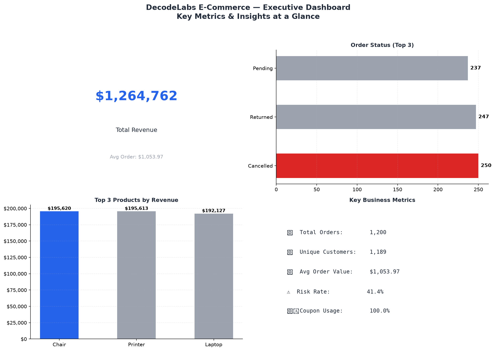

# 📊 DecodeLabs Data Analytics Internship Projects


[](https://www.linkedin.com/in/laharigosukonda)

---

## 👩‍💻 About This Repository

This repository contains **4 end-to-end Data Analytics Projects** completed as part of the **DecodeLabs Data Analytics Internship** (Aug–Sep 2026).

All projects use a real-world **e-commerce dataset (1,200 orders)** covering product sales, revenue trends, order statuses, and customer behavior across 7 product categories.

---

## 📁 Repository Structure

```
DecodeLabs-DataAnalytics/
│
├── 📄 data_cleaning.py               # Project 1 — Data Cleaning & Preparation
├── 📄 eda_analysis.py                # Project 2 — Exploratory Data Analysis
├── 📄 sql_analysis.py                # Project 3 — SQL Data Analysis
├── 📄 data_visualization.py          # Project 4 — Data Visualization & Storytelling
│
├── 📊 visualizations/
│   ├── chart1_revenue_by_product.png
│   ├── chart2_monthly_revenue_trend.png
│   ├── chart3_order_status_distribution.png
│   ├── chart4_quantity_by_product.png
│   ├── chart5_price_vs_quantity_scatter.png
│   ├── chart6_coupon_usage.png
│   └── chart7_executive_dashboard.png  ⭐
│
├── 📂 Dataset for Data Analytics.xlsx  # Original dataset
├── 📂 cleaned_dataset.csv              # Cleaned output
├── 📂 Cleaned_Dataset.xlsx             # Cleaned output (Excel)
├── 📂 EDA_Report.xlsx                  # EDA summary report
├── 📂 decodelabs.db                    # SQLite database
└── 📄 README.md
```

---

## 📦 Projects Overview

---

### ✅ Project 1 — Data Cleaning & Preparation
> `data_cleaning.py`

| Detail | Value |
|---|---|
| **Dataset Size** | 1,200 rows × 9 columns |
| **Tool Used** | Python, Pandas |
| **Tasks Completed** | Null handling, duplicate removal, data type fixing, validation |
| **Output** | `cleaned_dataset.csv`, `Cleaned_Dataset.xlsx` |

**Key Steps:**
- Identified and filled missing values in `Quantity` and `Price` columns
- Removed duplicate order entries
- Standardized date formats and validated all categorical fields
- Exported clean dataset for downstream analysis

---

### ✅ Project 2 — Exploratory Data Analysis (EDA)
> `eda_analysis.py`

| Detail | Value |
|---|---|
| **Tool Used** | Python, Pandas |
| **Total Revenue Analyzed** | $1,264,762 |
| **Products Analyzed** | 7 |
| **Output** | `EDA_Report.xlsx` |

**Key Findings:**
- 📦 Chair & Printer drove the highest revenue (~$195K each)
- 📅 Peak revenue month: **June 2024** ($68,069)
- 📉 Cancellation + Return rate: **41.4%** — major business risk
- 🎟️ **74.2%** of orders used discount coupons

---

### ✅ Project 3 — SQL Data Analysis
> `sql_analysis.py` | `decodelabs.db`

| Detail | Value |
|---|---|
| **Tool Used** | Python, SQLite |
| **Queries Written** | 30 SQL queries |
| **Concepts Covered** | SELECT, WHERE, GROUP BY, HAVING, ORDER BY, Subqueries, Aggregations |

**Query Categories:**
- 🔍 Basic filtering & selection (10 queries)
- 📊 Aggregation & grouping (10 queries)
- 🧠 Advanced subqueries & analysis (10 queries)

---

### ✅ Project 4 — Data Visualization & Storytelling
> `data_visualization.py`

| Detail | Value |
|---|---|
| **Tool Used** | Python, Matplotlib |
| **Charts Created** | 7 |
| **Chart Types** | Bar, Line, Pie, Donut, Scatter, Stacked Bar, Executive Dashboard |

**Charts:**

| # | Chart | Insight |
|---|---|---|
| 1 | Revenue by Product | Chair & Printer lead |
| 2 | Monthly Revenue Trend | June 2024 peak |
| 3 | Order Status Distribution | 41.4% loss rate |
| 4 | Quantity by Product | Headphones most ordered |
| 5 | Price vs Quantity Scatter | Inverse relationship |
| 6 | Coupon Usage | 74.2% coupon orders |
| 7 | ⭐ Executive Dashboard | Full business summary |

---

## 📊 Executive Dashboard Preview



---

## 💡 Top Business Insights

| # | Insight | Impact |
|---|---|---|
| 1 | 41.4% cancellation/return rate | 🔴 High — revenue loss risk |
| 2 | 74.2% orders used coupons | 🟡 Margin pressure |
| 3 | Chair & Printer = top revenue | 🟢 Focus marketing here |
| 4 | June 2024 was peak month | 🟢 Replicate seasonal strategy |
| 5 | Headphones = highest quantity | 🟡 Review pricing strategy |

---

## 🛠️ Tech Stack

| Tool | Purpose |
|---|---|
| Python 3.10 | Core programming language |
| Pandas | Data cleaning & EDA |
| Matplotlib | Data visualization |
| SQLite | SQL analysis & database |
| Git & GitHub | Version control & hosting |

---

## ⚡ How to Run

```bash
# 1. Clone the repository
git clone https://github.com/lasyalahari0101/DecodeLabs-DataAnalytics.git
cd DecodeLabs-DataAnalytics

# 2. Install dependencies
pip install pandas matplotlib openpyxl

# 3. Run each project
python data_cleaning.py
python eda_analysis.py
python sql_analysis.py
python data_visualization.py
```

---

## 🎓 Internship Details

| Field | Detail |
|---|---|
| **Company** | Decode Labs |
| **Role** | Data Analytics Intern |
| **Duration** | August 15 – September 15, 2026 |
| **Mode** | Remote / Virtual |
| **Status** | ✅ Completed |

---

## 👩‍💻 Author

**Sai Lasya Lahari Gosukonda**

[](https://www.linkedin.com/in/laharigosukonda)
[](https://github.com/lasyalahari0101)

---

⭐ *If you found this helpful, please star the repository!*
